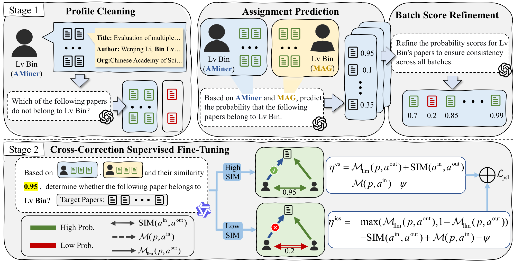

# CrossND

CrossND is a cross-source correction framework for author name disambiguation. It uses an API-based LLM to distill denoised soft labels, then trains a smaller task model with cross-source supervised fine-tuning and a probabilistic soft logic (PSL) objective.

This repository corresponds to the paper **"Cross-Source Reasoning-based Correction for Author Name Disambiguation"**.



## Framework

CrossND has three main components.

**Chain-of-Refinement Pipeline.** The upper part of the model figure distills high-quality supervision from an API-based LLM. It first cleans noisy author profiles, then predicts paper-author assignment scores using both internal and external sources, and finally refines the scores to reduce calibration inconsistency across LLM batches.

**Cross-Correction Supervised Fine-Tuning.** The lower part of the model figure trains the deployable CrossND model. Training examples are organized as triples `(paper, internal author, external author)`. Cross-source author similarity partitions the data into consistent and inconsistent subsets, and a PSL-based loss imposes logical constraints among `(paper, internal author)`, `(paper, external author)`, and `(internal author, external author)`.

**Test-Time Scaling.** At inference time, CrossND improves robustness by estimating confidence, distributing papers across batches with a snake strategy, and interleaving high- and low-confidence papers within each batch.

## Repository Structure

```text
CrossND/
├── cor/                    # Chain-of-Refinement label distillation pipeline
│   ├── self_clean.py       # Step 1: profile cleaning
│   ├── refine_crossnd.py   # Step 2: assignment prediction
│   ├── batch_refine.py     # Step 3: batch score refinement
│   ├── LLM.py              # OpenAI-compatible LLM API wrapper
│   └── utils.py
├── config/                 # DeepSpeed configuration files
├── assets/
│   └── model.png           # Camera-ready framework figure
├── model.py                # CrossND model and classification head
├── trainer.py              # Custom trainer with CE / PSL objectives
├── train.py                # SFT training entry
├── inference.py            # Inference and evaluation entry
├── train.sh                # Example training script
├── inf.sh                  # Example inference script
├── utils.py                # Data construction and evaluation utilities
└── requirements.txt
```

## Installation

```bash
cd CrossND
pip install -r requirements.txt
```

Main dependencies include PyTorch, Transformers, DeepSpeed, PEFT/LoRA, OpenAI-compatible API clients, and common scientific Python packages.

The Chain-of-Refinement scripts under `cor/` also require an OpenAI-compatible client:

```bash
pip install openai tqdm
```

## Data

CrossND supports KDD Cup and WhoIsWho-style author disambiguation data. The expected data directory contains author-paper mappings, paper metadata, cross-source triplets, and train/validation/test splits.

The processed KDD Cup data used by CrossND is available on Hugging Face:
[canalpang/kddcup_for_crossnd](https://huggingface.co/datasets/canalpang/kddcup_for_crossnd).
Download it and place the files under a local directory such as `kddcup_data/`.

For KDD Cup-style experiments, the common files are:

| File | Description |
|---|---|
| `aid_to_pids_in.json` | Internal source author-to-paper mapping |
| `aid_to_pids_out.json` | External source author-to-paper mapping |
| `paper_dict_mag.json` or `pub_dict.json` | Paper metadata |
| `train_triplets.json` or `alldata_nd_thr09_inout_sim.json` | Training triples |
| `valid_with_sim.json` | Validation triples with cross-source similarity |
| `test_with_sim.json` | Test triples with cross-source similarity |

The default scripts assume the downloaded data is available at `kddcup_data/`. Update paths in `train.sh`, `inf.sh`, and `cor/` commands before running.

## Stage 1: Chain-of-Refinement

The `cor/` directory implements the label distillation pipeline shown in the upper part of the model figure.

### Step 1: Profile Cleaning

Profile cleaning builds a coreset for each author by asking the LLM whether each paper is consistent with the author profile.

```bash
cd CrossND/cor

python self_clean.py \
  --model gpt-5 \
  --target /path/to/aid_to_pids_in.json \
  --paper_dict /path/to/paper_dict_mag.json \
  --triplets_train /path/to/train_triplets.json \
  --triplets_test /path/to/test_with_sim.json \
  --triplets_valid /path/to/valid_with_sim.json
```

Run the same command with `--target /path/to/aid_to_pids_out.json` to clean the external source.

### Step 2: Assignment Prediction

Assignment prediction uses cleaned internal and external profiles to assign a soft probability to each target paper.

```bash
python refine_crossnd.py \
  --src /path/to/test_with_sim.json \
  --model gpt-5 \
  --save_name kdd_step2 \
  --paper_dict /path/to/paper_dict_mag.json \
  --in_name2pid /path/to/aid_to_pids_in.json \
  --out_name2pid /path/to/aid_to_pids_out.json \
  --clean_in_name2pid /path/to/cleaned_aid_to_pids_in.json \
  --clean_out_name2pid /path/to/cleaned_aid_to_pids_out.json
```

### Step 3: Batch Score Refinement

Batch score refinement calibrates the soft scores from Step 2. It is designed to reduce score-scale inconsistency across LLM prediction batches while preserving the relative ordering of most papers.

```bash
python batch_refine.py \
  --src /path/to/refine_output/kdd_step2.json \
  --model gpt-5 \
  --save_name kdd_step3 \
  --paper_dict /path/to/paper_dict_mag.json \
  --in_name2pid /path/to/aid_to_pids_in.json \
  --out_name2pid /path/to/aid_to_pids_out.json \
  --clean_in_name2pid /path/to/cleaned_aid_to_pids_in.json \
  --clean_out_name2pid /path/to/cleaned_aid_to_pids_out.json
```

Configure the OpenAI-compatible API endpoint in [cor/LLM.py](cor/LLM.py). Do not commit API keys to the repository.

## Stage 2: Cross-Correction SFT

After Chain-of-Refinement, the distilled scores are used as supervision for the CrossND model. The training objective combines cross-entropy with a PSL loss over cross-source triples.

The default training script uses LoRA, DeepSpeed, a binary classification head, and the `psl` loss:

```bash
cd CrossND

# Edit MODEL_PATH, DATA_SRC, DATA_DIR, and OUTPUT_DIR in train.sh first.
bash train.sh
```

Important options in [train.sh](train.sh):

| Option | Meaning |
|---|---|
| `MODEL_PATH` | Base LLM path or Hugging Face model id |
| `DATA_SRC` | Training data with cross-source triples and similarity |
| `DATA_DIR` | Directory containing metadata and split files |
| `LOSS_TYPE=psl` | Enables the PSL-based objective |
| `--use_outer true` | Uses the external source in the prompt |
| `NUM_TURN` | Number of papers predicted in one multi-turn context |
| `LORA_R`, `LORA_ALPHA`, `LORA_DROPOUT` | LoRA configuration |

## Inference and Evaluation

Run inference with a trained LoRA checkpoint:

```bash
cd CrossND

# Edit the working directory, MODEL_PATH, LORA_PATH, DATA_SRC, DATA_DIR,
# and OUTPUT_DIR in inf.sh first.
bash inf.sh
```

The inference script evaluates paper-author correction scores and reports metrics such as AUC, MAP, and the combined model-selection metric used during training.

## Implementation Notes

- `cor/` corresponds to the camera-ready figure's Chain-of-Refinement Pipeline.
- `train.py`, `trainer.py`, and `model.py` correspond to Cross-Correction Supervised Fine-Tuning.
- `trainer.py` implements the PSL-aware training objective used by `LOSS_TYPE=psl`.
- `inference.py` supports evaluation with the trained CrossND model.
- The current scripts are examples; update model, data, checkpoint, and API paths for your environment.

## WhoIsWho IND Benchmark

The WhoIsWho IND benchmark is available at the
[KDD Cup 2024 IND competition page](https://www.biendata.xyz/competition/ind_kdd_2024/).

## Citation

If you use this repository, please cite:

```bibtex
@inproceedings{crossnd2026,
  author = {Zhang, Fanjin and Pang, Yunhe and Chen, Bo and Shen, Zhiyu and Rao, Yanghui and Kharlamov, Evgeny and Tang, Jie},
  title = {Cross-Source Reasoning-based Correction for Author Name Disambiguation},
  booktitle = {Proceedings of the 32nd ACM SIGKDD Conference on Knowledge Discovery and Data Mining V.2},
  year = {2026},
  address = {Jeju, Korea},
  month = aug
}
```

## License

MIT License

